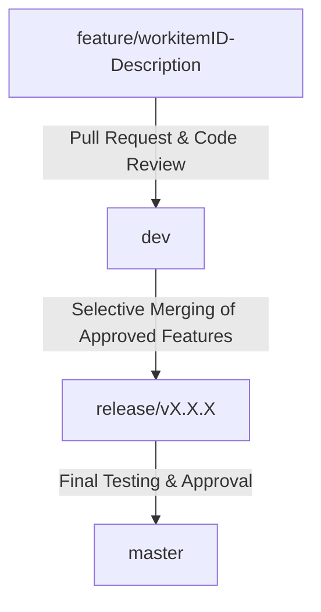

## Project Workflow Overview

This project follows a branching strategy that includes a dedicated release branch for selective feature inclusion. Code progresses through structured branches to ensure quality control and organized releases.

#### Key Branches
- **master**: The production-ready branch.
- **dev**: The main development branch, where completed work items are integrated.
- **release/vX.X.X**: Created from `master` for each release, allowing selective merging of specific features from `dev`.

### Code Movement Flow (Mermaid Diagram)

### Contributor Guidelines

As a contributor, your role involves developing, testing, and refining features or fixes based on assigned work items. Follow these guidelines:

1. **Branch Naming and Creation**:
   - Create a branch from `dev` for each work item using this format: `feature/<workitemID>-<short-description>`.
   - Example: `feature/1234-add-login`.

2. **Development and Testing**:
   - Write and update unit tests to cover new functionality.
   - Run tests locally to ensure they pass before pushing changes.

3. **Pull Request to `dev`**:
   - Submit a pull request (PR) to merge your feature branch into `dev`.
   - Ensure all automated tests pass in the CI pipeline before requesting review.

---

### Collaborator Guidelines

Collaborators are responsible for code reviews, ensuring quality, and managing releases.

1. **Code Review Responsibilities**:
   - Review PRs from contributors merging into `dev`.
   - Confirm that all tests pass and that code meets quality standards.

2. **Release Branch Management**:
   - When preparing a release, create a `release` branch (e.g., `release/v1.0`) from `master`.
   - Selectively merge individual, approved feature branches from `dev` to the `release` branch.
   - Perform final testing on the `release` branch.

3. **Approval and Final Merge**:
   - After testing, approve and merge the `release` branch into `master` for production deployment.
   - Document all included features for the release notes.

4. **Post-Release Cleanup**:
   - **Delete Feature Branches**: After merging into `master`, delete the feature branches that are part of the release to keep the repository organized.

---

